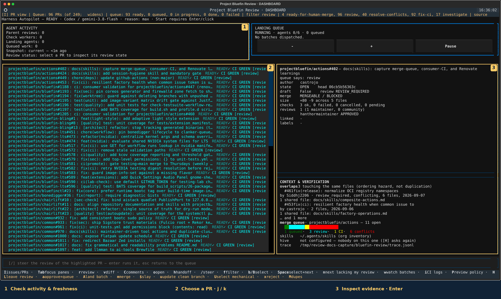
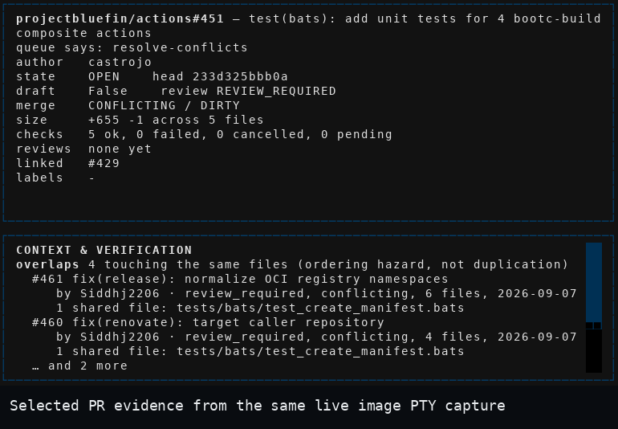

<p align="center">
  
</p>

# Bluefin Review

enslaving the oppressors since 2026

**A live pull-request dashboard for maintainers, and a Hive worker for the toil.**
Inspect changes, CI and review evidence in one terminal, then choose what to
review and what to land. Powered by [Hive](https://hive.hivecommons.dev/),
Goose and the bundled Codex CLI. Humans retain review and merge authority;
Hive assigns contributor work.

[Quick start](#quick-start) · [Dashboard tour](#inspect-then-review) · [Guides](#learn-more)

## Quick start

Run these commands on your Linux host, from the checkout root. You need
Git, `just`, rootless Podman and the GitHub CLI (`gh`).

```bash
git clone https://github.com/projectbluefin/review.git
cd review
gh auth login --web --hostname github.com --scopes repo,read:org
```

Choose your review backend before launching:

| Backend | One-time model authentication | Launch from the checkout |
| --- | --- | --- |
| Goose + GitHub Copilot (default) | Install Goose, run `goose configure`, choose GitHub Copilot and complete its device flow. | `just review-queue` |
| Codex subscription | Run `codex login` with file credential storage so the launcher can read `~/.codex/auth.json` (or `$CODEX_HOME/auth.json`). | `BLUEFIN_REVIEW_BACKEND=codex just review-queue` |

GitHub login and model login are separate: a GitHub CLI token does not
authenticate Copilot inference. Goose launches refuse missing Copilot credentials
rather than dispatch agents that cannot start. Explicit Codex selection needs no host Goose
or Copilot credential.

```bash
just review-doctor
just review-queue
```

Doctor checks readiness without starting an agent. The default launch pulls
`ghcr.io/projectbluefin/review:stable` and opens the maintainer dashboard.
For one repository, use `just review-queue projectbluefin/review`.
See the [launcher guide](docs/skills/launcher.md) for model profiles,
credential handoff, remote Podman and Kubernetes sessions.

## Inspect, then review

[](docs/images/dashboard-overview.png)

*Real dashboard rendered from exact local image `sha-dfaa27e544a1ed6f21c7e98dce418a7dbddb5bac`
(image ID `adbc75a71c2d…`) at 170 columns × 44 rows, using live GitHub queue data.
The numbered annotations are outside the terminal pixels; open the image at full size.*

`review` comes with Goose and the official Codex CLI prebundled and
passes through only the credential each selected client needs.

1. **Check activity and freshness.** The top panels show review workers and
   landing work. An idle session is normal; opening the dashboard starts no review.
2. **Choose a pull request.** Use `j` / `k` to move, `f` to cycle the action
   filter, and `R` to refresh. The capture shows Bluefin LTS with all action types; launch defaults
   to the whole organization. `Tab` moves focus between panes.
3. **Read the evidence.** Inspect the selected PR's checks, merge state and
   context. `Enter` opens its diff, or existing review evidence when available.
   `v` opens the diff, `C` comments, and `o` the GitHub page.

Use `$` to slay selected PRs through the gated review/fix/land flow. For issues,
it dispatches a fixer that opens a PR under your account or files an evidenced
finding; it never merges the resulting PR itself.

4. **Start a review when ready.** Press `r`; use `/` to steer the review or
   `y` to hand its context to your own client. `?` shows current key help and
   `Ctrl-p` opens the command palette. `Esc` returns from an inspection view;
   at the dashboard it exits.



A review draft is evidence for your decision. Review submission, approve-and-queue,
merge and fix-and-land are distinct actions with side effects; inspect their
confirmation before proceeding. GitHub permissions and branch protections still
apply. See [review controls](docs/skills/review-dashboard.md) and
[batch landing](docs/skills/landing-batches.md) before using batch actions.

## Put a worker to work

| Goal | Command |
| --- | --- |
| Donate a foreground Goose worker to Hive | `just contribute` |
| Select Codex for a contributor worker | `TOOL=codex just review-container` |
| Scale three cluster workers, then open the dashboard | `just turbo-review` |
| Stop cluster workers | `just review-stop cluster` |

Workers use your GitHub identity and receive their assignments from Hive.
The attended launcher runs Hive setup if its registration is missing.
`BLUEFIN_REVIEW_BACKEND` selects the dashboard backend; `TOOL` selects the
contributor backend (`TOOL=goose` by default). Turbo requires a usable Kubernetes cluster; start with
[cluster workers](docs/skills/cluster-workers.md) before scaling out.

Interactive runs stay attached to the launching terminal; **Ctrl-C stops them**.
Detached contributor containers are unsupported (`REVIEW_DETACH=1` is rejected). Cluster workers have a separate
lifecycle and stop with `just review-stop`. Agents can use the permissions on
their GitHub token: scope credentials to the work, and never loosen Hive
registration permissions. Optional dashboard cluster access requires an explicit
session opt-in; declining it leaves registry-based review available.

## Learn more

| I want to… | Read |
| --- | --- |
| Understand roles, authority and architecture | [Agentic model](docs/factory/agentic-model.md) |
| Configure authentication, profiles or launch modes | [Launcher](docs/skills/launcher.md) |
| Inspect reviews and use dashboard controls | [Dashboard](docs/skills/review-dashboard.md) |
| Manage a batch and inspect landing results | [Landing batches](docs/skills/landing-batches.md) |
| Monitor workers or diagnose an assignment | [Monitoring](docs/skills/review-monitoring.md) · [Hive triage](docs/skills/hive-triage.md) |
| Run contributors on Kubernetes | [Cluster workers](docs/skills/cluster-workers.md) |
| Understand optional cluster verification | [Lab broker](docs/skills/lab-broker.md) |
| Understand specialized review checks | [Review checks](docs/skills/review-checks.md) |
| Build, validate or audit the image | [Image and development](docs/image-and-development.md) · [Image audit](docs/skills/image-audit.md) |
| Contribute a small, evidenced change | [Contribution culture](docs/skills/contribution-culture.md) · [Agent contract](AGENTS.md) |
| Find another task-specific guide | [Documentation index](docs/SKILL.md) |

## What this is for

The appliance reduces maintainer toil: broken builds, stale pins, drifted docs
and unreproduced reports. Its next steps include agent-assisted documentation
([#134](https://github.com/projectbluefin/review/issues/134)) and the watcher
feedback loop ([#135](https://github.com/projectbluefin/review/issues/135)).

The image layers the pinned Hive runtime at `c7a88b8518abf1163e13803b2094f2262605490b`;
see [image architecture and validation](docs/image-and-development.md).

Licensed under [Apache 2.0](LICENSE). [Visual credits](docs/images/README.md).
