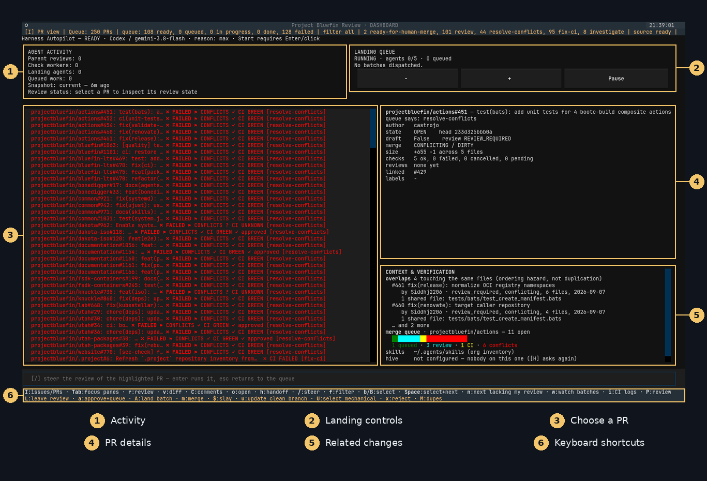

<p align="center">
  
</p>

# Bluefin Review

enslaving the oppressors since 2026

**Review pull requests, inspect CI failures, and land changes from your terminal.**
Bluefin Review brings the evidence and actions into one dashboard. You choose
what to review and what to merge; GitHub permissions and branch protections
still apply.

[Quick start](#quick-start) · [Using the dashboard](#using-the-dashboard) · [Run a worker](#run-a-worker) · [Guides](#guides)

## Quick start

You need **Linux, rootless Podman, Git, `just`, and GitHub CLI (`gh`)**.
Goose and Codex are bundled in the container; model authentication is a
separate, one-time setup on your host.

### 1. Get the launcher and sign in to GitHub

```bash
git clone https://github.com/projectbluefin/review.git
cd review
gh auth login --web --hostname github.com --scopes repo,read:org
```

### 2. Choose one review backend

**Goose + GitHub Copilot — the default**

If you have not configured it, install Goose on your host and run
`goose configure`, selecting GitHub Copilot. Then launch:

```bash
just review-queue
```

**Codex subscription — an alternative**

Complete `codex login` on your host using file credential storage, then launch:

```bash
BLUEFIN_REVIEW_BACKEND=codex just review-queue
```

Codex selection does not require Goose or a Copilot credential on the host.
A GitHub CLI login alone does **not** authenticate either review backend.
See the [launcher guide](docs/skills/launcher.md) for authentication setup,
model profiles, and troubleshooting. For the default Goose setup,
`just review-doctor` checks readiness without starting an agent.

### 3. Start with one repository, or browse the organization

The commands above open the whole Project Bluefin queue. To narrow it, append
a repository—for example, `just review-queue projectbluefin/review`.
The launcher pulls `ghcr.io/projectbluefin/review:stable`; no local image build
is required. Opening the dashboard does not start a review.

## Using the dashboard

[](docs/images/dashboard-overview.webp)

*An example session using real GitHub data. Open the image for full resolution;
its counts are a captured moment, not a live status report.*

The numbers identify these areas:

1. **Activity:** running reviews, landing work, and data freshness.
2. **Landing controls:** concurrency and pause/resume for queued batches.
3. **Choose a PR:** move with `j` / `k`, change the filter with `f`, or refresh with `R`.
4. **PR details:** inspect its checks, exact head, review, and merge state.
5. **Related changes:** check overlapping work before taking action.
6. **Keyboard shortcuts:** use `Tab` to move between panes and `?` for help.

When ready, `v` opens the diff, `C` opens the conversation, and `r` starts a
review. `/` adds instructions; `y` hands the context to your own client.

Review submission, queueing, and merging are distinct actions. Read the
confirmation before authorizing a change; a clean review is not permission
to merge. The [dashboard guide](docs/skills/review-dashboard.md) explains the
complete keyboard and mouse workflow.

For batches, `$` follows the gated review/fix/land flow. On selected issues it
opens a PR or files an evidenced finding, rather than merging its own work.
The landing controls `+` / `−` change concurrency and Pause suspends new
dispatches—not agents already running. See [batch landing](docs/skills/landing-batches.md).

## Run a worker

This is a separate mode: **Hive assigns contributor work; the dashboard is for
human review.** Choose one worker backend:

```bash
just contribute                         # default Goose worker (TOOL=goose)
TOOL=codex just review-container         # Codex contributor worker
```

Keep the launching terminal open. **Ctrl-C stops the attended worker.**
Detached contributor containers are unsupported (`REVIEW_DETACH=1` is rejected).

Kubernetes users can scale workers with `just turbo-review` and stop them with
`just review-stop cluster`. Start with the [cluster guide](docs/skills/cluster-workers.md);
a cluster is not required for the ordinary dashboard.

## Guides

- **Setup, credentials, models, remote runtimes:** [Launcher](docs/skills/launcher.md)
- **Review controls and evidence:** [Dashboard](docs/skills/review-dashboard.md)
- **Batch progress and failures:** [Landing batches](docs/skills/landing-batches.md)
- **Worker status and troubleshooting:** [Monitoring](docs/skills/review-monitoring.md) · [Hive triage](docs/skills/hive-triage.md)
- **Build and verify the image:** [Image and development](docs/image-and-development.md) · [Image audit](docs/skills/image-audit.md)
- **Architecture and authority boundaries:** [Agentic model](docs/factory/agentic-model.md)
- **Contribute:** [Contribution culture](docs/skills/contribution-culture.md) · [Agent contract](AGENTS.md)
- **All documentation:** [Documentation index](docs/SKILL.md)

## What this is for

Reduce maintainer toil: broken builds, stale pins, drifted documentation, and
unreproduced reports. Planned documentation assistance is tracked in
[#134](https://github.com/projectbluefin/review/issues/134); the feedback loop
is tracked in [#135](https://github.com/projectbluefin/review/issues/135).

<details>
<summary>Image provenance</summary>

The image layers the pinned Hive runtime at `c7a88b8518abf1163e13803b2094f2262605490b`.
See [image architecture and validation](docs/image-and-development.md).

</details>

Licensed under [Apache 2.0](LICENSE). [Visual credits](docs/images/README.md).
